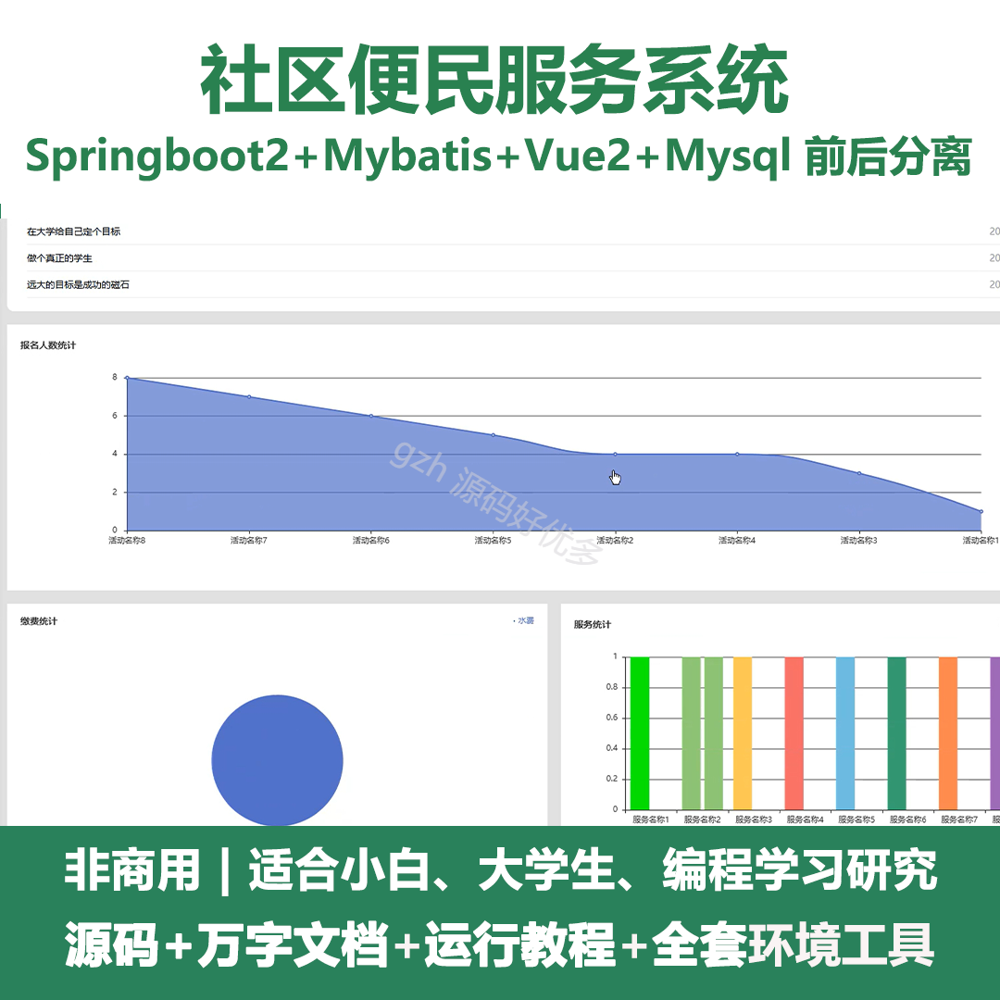
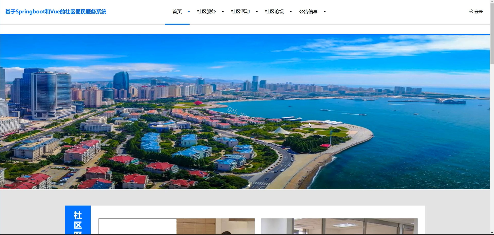
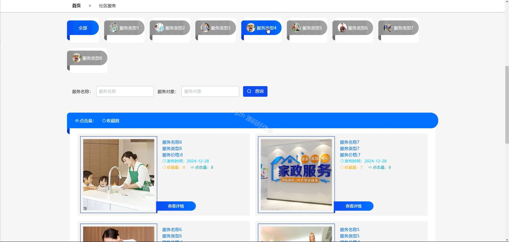
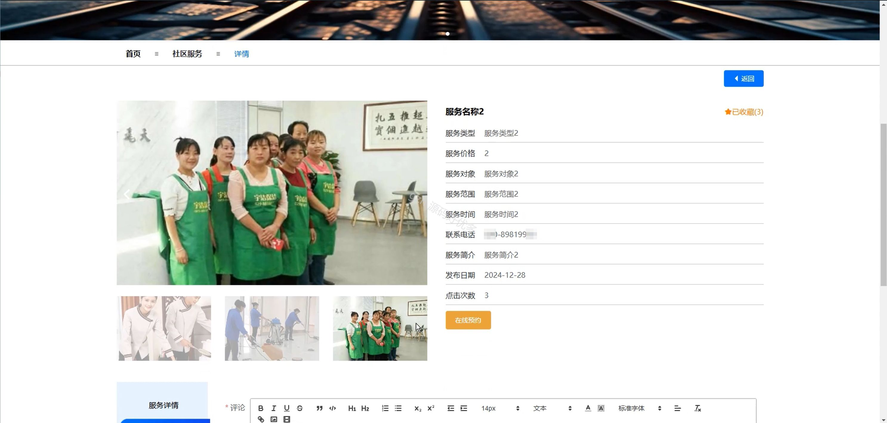
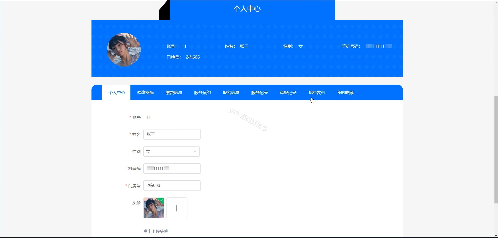
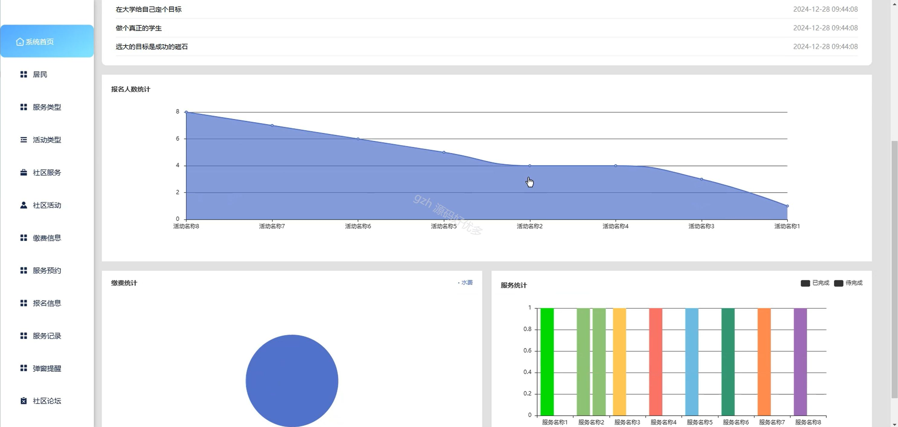
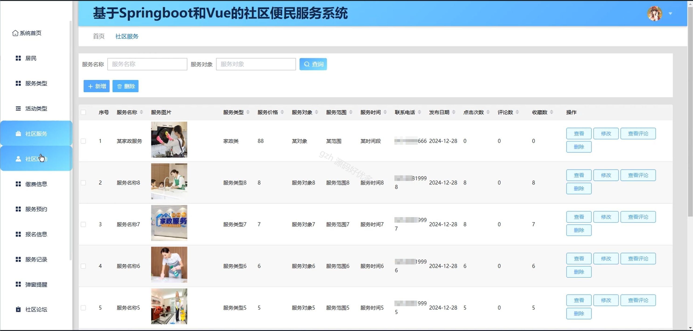
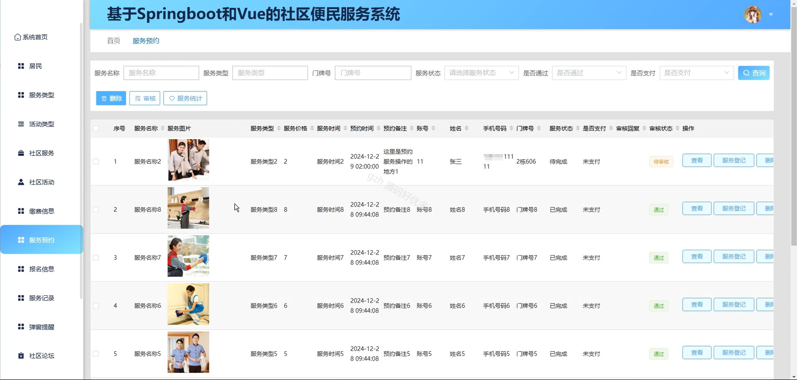
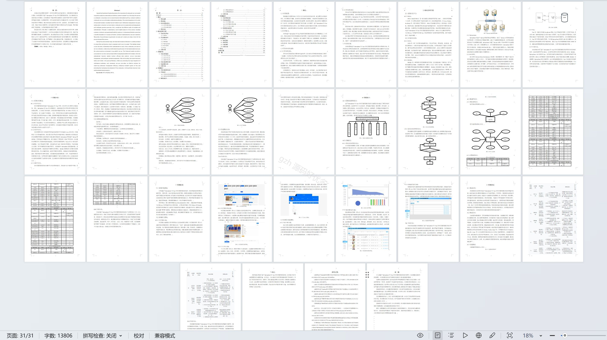

# springbootA271D
springbootA271D社区便民服务系统
 
## 查看主页获取源码

### 一、关键词
社区服务、社区活动、社区论坛

### 二、作品包含
源码+数据库+设计文档万字+全套环境和工具资源+本地部署教程

### 三、项目技术
前端技术：Html、Css、Js、Vue2.0、Element-ui 
后端技术：Java、SpringBoot2.0、MyBatis

### 四、运行环境（以下版本亲测，其他版本未知，请自测）
开发工具：IDEA/eclipse  + VSCODE

数据库：MySQL5.7（最低要5.7版本）

数据库管理工具：Navicat10以上版本

环境配置软件： JDK1.8 + Maven3.6.3

前端Nodejs：14

浏览器：谷歌浏览器

### 五、项目介绍
项目编号：springbootA271D

社区便民服务系统是整合社区各类服务资源，为居民提供便捷、高效的一站式社区服务的数字化平台。

角色：管理员、用户

管理员：系统首页、居民、服务类型、活动类型、社区服务、社区活动、缴费信息、服务预约、报名信息、服务记录、弹窗提醒、社区论坛、论坛分类、举报记录、系统管理、个人中心。

用户：首页、社区服务、社区活动、社区论坛、公告信息、个人中心、修改密码、缴费信息、服务预约、报名信息、服务记录、举报记录、我的发布、我的收藏。

### 六、运行截图

